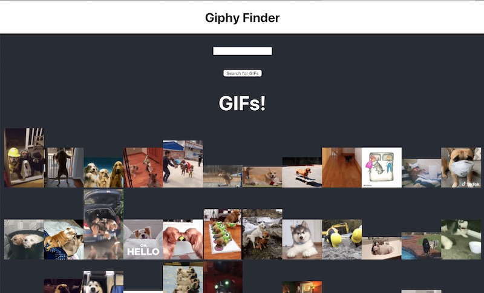

# React-driven *GIF Finder*

## Overview

- Here we'll be using `create-react-app` and the Giphy web service to create a GIF viewing app that utilizes the Giphy web service:
  - https://giphy.com
  - https://developers.giphy.com
- Here is the finished version (after a search for "dogs" was conducted): 




## I. React Function components (with hooks)
- docs on hooks are here:
  - React *hooks* are newer, and allow you to add *state* to a FSC - so now we can just call them *Function Components*:
    - *state hooks* - creates a getter and setter for a state variable.  Changing this variable will trigger a re-render of any part of the component that depends on the variable (a *binding*)
    - *effect hooks* - used in conjunction with *state hooks*, and lets you notify other parts of your program that a variable value has changed
  - https://reactjs.org/docs/hooks-intro.html
- start code is the `create-react-app` script:
  - https://reactjs.org/docs/create-a-new-react-app.html#create-react-app
  - running version on Heroku: https://gif-finder-2201.herokuapp.com
  - https://www.fastcompany.com/90505929/the-real-reason-facebook-bought-giphy-for-400-million
- here's an XHR helper function that will save you a lot of typing:

```js
 // Helper function to fetch data from Giphy
  const fetchData = ()=>{
    const GIPHY_URL = "https://api.giphy.com/v1/gifs/search";
    const GIPHY_KEY = "dc6zaTOxFJmzC"; // public API key from here: https://github.com/Giphy/GiphyAPI
   
    term = encodeURIComponent(term.trim());
		if(term.length < 2) return;
    
    let url = `${GIPHY_URL}?api_key=${GIPHY_KEY}&q=${term}`;

    const xhr = new XMLHttpRequest();

    xhr.onerror = (e) => console.log("XHR error");

    xhr.onload = (e) => {
      const jsonString = e.target.response;
      const json = JSON.parse(jsonString);
    
     // TODO
    // update `results` array an the UI
     
    }; // end xhr.onload
    
    xhr.open("GET",url);
    xhr.send();
  };
```
