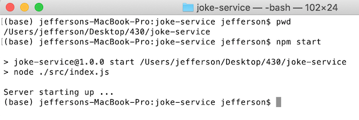
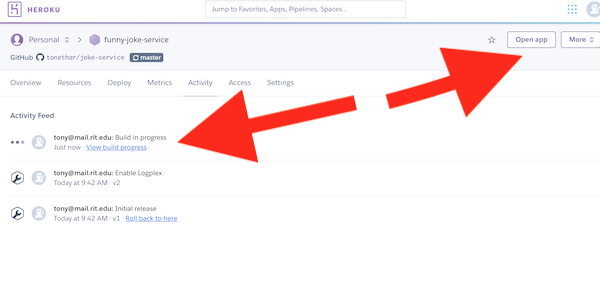
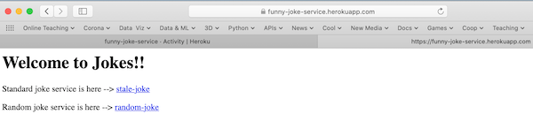

# HW - Node Simple Web API


## I. Overview

- We are going to create a simple [*Web API*](https://en.wikipedia.org/wiki/Web_API) using node and npm
- Because this is a very simple app, we are going to do so without using any node packages such as [Express](https://www.npmjs.com/package/express)
- We are going to deploy the code for our API to the ["platform as service"](https://www.heroku.com/platform) provider [Heroku](https://www.heroku.com/#) using Git & Github
- This web service will serve up a random joke in [JSON](https://www.json.org/json-en.html) format
- Below are screenshots of the landing page for the service, the `/stale-joke` and `/random-joke` endpoints, and a client web app that uses the web service

<hr>

**The landing page**


<hr>

**`/stale-joke`**


<hr>

**`/random-joke`**


<hr>

**A client web app that uses the random-joke [endpoint](https://stackoverflow.com/questions/2122604/what-is-an-endpoint)**

- the code for this client provided at the end of this tutorial


<hr>

## II. Getting ready

1) You need a console app to type commands into:
    - On Mac OS you can use the built-in *Terminal* app
    - On Windows you can use one of these:
      - [Windows Terminal](https://www.microsoft.com/en-us/p/windows-terminal/9n0dx20hk701)
      - GitBash (this also installs git) - https://www.stanleyulili.com/git/how-to-install-git-bash-on-windows/
      - Powershell - https://docs.microsoft.com/en-us/powershell/scripting/install/installing-powershell
    - You should also know some basic Unix commands such as `cd`, `ls` and `pwd` - [Unix Cheatsheet](http://www.rain.org/~mkummel/unix.html)
    
2) You must have **Node.js** & **npm** ("Node Package Manager")) installed - see the install instructions here --> https://docs.npmjs.com/downloading-and-installing-node-js-and-npm

3) If you are going to deploy this to app to Heroku you will need:
    - A Github account (free!) - https://education.github.com/pack
    - Git - https://git-scm.com/book/en/v2/Getting-Started-Installing-Git
    - A Heroku account (free!) - https://signup.heroku.com

<hr>

## III. Get started - creating and cloning a GitHub repository

- So that we can deploy this app (our web API) to the web using Heroku, we will need to set up a GitHub repository for the app. This is because Heroku uses GitHub to upload the app's files (as opposed to using an FTP client if we were working with a web server like Apache)
- If you do not intend to deploy this app to the web and will instead just run it locally, then you can skip the steps below. Instead, just create a folder on your desktop named **joke-service**

1) Login to your GitHub account and create a new repository named **joke-service** - you don't need to add a README or anything - just keep it empty

2) Copy the *clone URL*

<hr>


<hr>

3) Open your console app (Terminal, GitBash, et al.)

4) *Change directory* to whatever folder on your computer that you want to do work in:
    - you can accomplish this by typing `cd`, then a space, and then dragging the folder into the console window, which should copy the file path to that folder into the console window. The type enter.
    - On Unix/Linix machines like Mac OS, or in GitBash, you should go ahead and verify that your [*current working directory*](https://en.wikipedia.org/wiki/Working_directory) is your chosen folder by typing `pwd` (*print working directory*)
    
5) Type `git clone <url>` (replace `<url>` with the clone URL of your repository)

6) Type `ls` to verify that you have downloaded your (empty) repository

<hr>


<hr>

## IV. Create a package.json file
  
1) Type `cd joke-service` to make **joke-service** your current working directory. Then type `pwd` to verify that you were successful.

<hr>


<hr>

2) Type `npm init -y` to create a **package.json** file with the default values - https://docs.npmjs.com/cli/init

    - it will look something like this:
    
```js
{
  "name": "joke-service",
  "version": "1.0.0",
  "description": "",
  "main": "index.js",
  "scripts": {
    "test": "echo \"Error: no test specified\" && exit 1"
  },
  "repository": {
    "type": "git",
    "url": "git+https://github.com/tonethar/joke-service.git"
  },
  "keywords": [],
  "author": "",
  "license": "ISC",
  "bugs": {
    "url": "https://github.com/tonethar/joke-service/issues"
  },
  "homepage": "https://github.com/tonethar/joke-service#readme"
}
```

- Go ahead and add values for `"author"` and `"keywords"` if you want

<hr>

## V. Create index.js

1) Inside of **joke-service**, create a folder named **src**

2) Inside of **src**, create a file named **index.js**

3) Add this line of code to **index.js**

```js

console.log("Server starting up ...");

```

4) Test your code by typing `node ./src/index.js` into the console (assuming that your current working directory is **joke-service**):
  - you should see `Server starting up ...` logged to the console
  
5) If anything went wrong:
    - first double-check that you have node and npm installed - type the following into the console (which will echo out the version number of node and npm):
      - `node -v`
      - `npm -v`
    - then type `pwd` to verify that your *current working directory* is **joke-service**


<hr>


<hr>

## VI. Update package.json

1) The first thing we are going to add to **package.json** is a `"start"` key (which goes under the `"scripts"` key) 
    - the `"start"` key will have a value of `"node ./src/index.js"`
    - the the `"scripts"` key of your **package.json** file should now look this:
    
```json
"scripts": {
    "test": "echo \"Error: no test specified\" && exit 1",
    "start": "node ./src/index.js"
  },
```

2) On the command line, type `npm start` - which is short for `npm run start` - this will run the command you just added to the **package.json** file (i.e) the value of the `"start"` key. This does the same thing we did in Part V. above, but with less typing and remembering!

<hr>



<hr>

3) Now we are going to install ONE npm package - just one external dependency - the nodemon project - this is going to be a *development dependency* that will make our lives easier:
    - you can read about it here: https://www.npmjs.com/package/nodemon
    - what nodemon will do for us will be to automatically restart our app any time we make changes to our files - this will end up saving us a lot of time over the long haul of writing and debugging an app
  
4) To install nodemon for just this app type `npm install --save-dev nodemon`

<hr>


<hr>

5) The `--save-dev nodemon` flag will add a `"devDependencies"` key to **package.json** - which looks something like this (your version number may vary):

```js
"devDependencies": {
    "nodemon": "^2.0.4"
  }
```

6) To use the monitoring capabilities of nodemon, we just need to add this to the `"scripts"` key of **package.json**:
    - `"nodemon": "nodemon --watch ./src ./src/index.js"`
    - The above command will "watch" the contents of the `src` folder for changes, and when it sees any it will restart the server by running the script at "./src/index.js"
    - the the "scripts" key of your package.json file should now look this:
    
```js
"scripts": {
    "test": "echo \"Error: no test specified\" && exit 1",
    "start": "node ./src/index.js",
    "nodemon": "nodemon --watch ./src ./src/index.js"
 }
```
    
7) Now test nodemon by typing `npm run nodemon` in the console, and then make a small change to **index.js**:
    - you should see the server restart and the change reflected in the console:

<hr>


<hr>

## VII. Serve up the landing page

- Now that we have the project setup, let's finally write some code to serve up our web API's default "landing page" that documents the API endpoints
- Recall that we are not going to use the Express package to do this - why not?
  - This a pretty simple app, so we don't need any of the functionality that Express provides
  - By instead using the built-in capabilities of Node's **http** module, we can avoid a 500+ kByte download and (more importantly) 51 dependencies - https://arve0.github.io/npm-download-size/#express


1) Type the following into **index.js**

<hr>


<hr>

- the first line of code imports the built-in **http** module and aliases it to a `http` variable in our program - you can read about **import** and the **http** module here: 
    - https://nodejs.org/api/modules.html#modules_require_id
    - https://nodejs.org/api/http.html#http_class_http_serverresponse
- the second line of code sets up a *port* (which you can read about here - [Port_(computer_networking)](https://en.wikipedia.org/wiki/Port_(computer_networking)) - which will be 3000 when we test locally. One of the other values (`process.env.PORT` & `process.env.NODE_PORT`) will be used as a port value when this app runs in the cloud on Heroku
- the third line of code is the HTML string for our landing page. More commonly this HTML be stored in a separate file or template and then loaded in by our JavaScript, but we're trying to keep this example simple:
  - note that the entire string is an ES6 [Template Literal](https://developer.mozilla.org/en-US/docs/Web/JavaScript/Reference/Template_literals) and enclosed in backticks (the key near your escape key) NOT single-quotes

2) Note that nodemon should be automatically rebooting the server everytime you save any changes to **index.js** - before you move on - be sure that there are no syntax errors and that the successfully code runs. See the screeenshot below:

<hr>


<hr>

3) Here's our joke data - we won't need it until Part VIII. below - but here it is anyway:
    - it's an array of [object literals](https://developer.mozilla.org/en-US/docs/Web/JavaScript/Reference/Operators/Object_initializer)
    - each object literal has a `"q"` and an `"a"` key
    - here is the joke data for your copy & paste pleasure:

```js
const jokes = [
	{"q" : "Why did the chicken cross the road?", "a" : "To get to the other side!"},
	{"q" : "What do you call a very small valentine?","a":"A valen-tiny!"},
	{"q" : "What did the dog say when he rubbed his tail on the sandpaper?","a":"Ruff, Ruff!"},
	{"q" : "Why don't sharks like to eat clowns?","a":"Because they taste funny!"},
	{"q" : "What did the boy cat say to the girl cat?","a":"You're Purr-fect!"},
	{"q" : "What is a frog's favorite outdoor sport?","a":"Fly Fishing!"}
];
```

4) Below are 3 more JavaScript statements to type in:

<hr>


<hr>


- the first statement above is an ES6 style [arrow function expression](https://developer.mozilla.org/en-US/docs/Web/JavaScript/Reference/Functions/Arrow_functions) that defines a *request handler* - which is a function that will be called whenever an HTTP request comes into our server
- the second line of code creates our web server, and passes in the request handler and port:
    - this code is "where the magic happens" - it creates a server and then sets up a function to be called every time an HTTP [User Agent](https://en.wikipedia.org/wiki/User_agent) contacts the server
    - note that this line of code is using [*method chaining*](https://medium.com/backticks-tildes/understanding-method-chaining-in-javascript-647a9004bd4f)
    - the docs for `http.createServer()` are here: https://nodejs.org/api/http.html#http_http_createserver_options_requestlistener
- the third line of code logs out the port number, which will be 3000 when we are running the app locally on our machine
- see the screeenshot below:

<hr>


<hr>

5) If nodemon is running, the app should restart when you save the changes to the code:

    - now head to a browser window and connect to `http://localhost:3000/` - you should see a log of the URL to the console - in this case a `/`
    - now change the URL to `http://localhost:3000/stale-joke` - you should see another log of the URL to the console - now it's `/stale-joke`
    - you will also see an error in the browser window - because our web server didn't send any data back - we'll fix that in the next step!
    - see the screeenshot below:
    
<hr>


<hr>

6) Go ahead and declare the `getIndex` function - see below:

<hr>


<hr>

- the above function uses methods of the [`ServerResponse`](https://nodejs.org/api/http.html#http_class_http_serverresponse) class to return:
  - the HTTP status code of `200` (which means "Ok") - read about HTTP status codes here: https://developer.mozilla.org/en-US/docs/Web/HTTP/Status
  - the `content-type: text/html` HTTP header:
    - read about MIME types here: https://www.iana.org/assignments/media-types/media-types.xhtml
    - read about HTTP response headers here: https://en.wikipedia.org/wiki/List_of_HTTP_header_fields#Response_fields
    - addtional HTTP headers can be added as key:value pairs
  - (the status code and headers are basically *metadata* about the server response)
  - to send the actual content (the HTML page) `response.write()` is used

7) Finally, let's add `getIndex(request, response);` to the bottom of `onRequest`:

<hr>


<hr>

8) Now our server will return our "landing" web page - no matter what url (aka "endpoint") we ask for:
  - go ahead and click on the "stale-joke" & "random-joke" links - the browser location bar will update - but the visible web page will not change ... yet
  - **IMPORTANT** - note that while nodemon WILL reload the server everytime we modify **index.js**, we will still need to manually reload the web browser to see these server changes. There IS however another node package that will also reload your browser automatically - it's called [Browserify](http://browserify.org) - we are not going to set it up today - but you can take a crack at doing so if you wish.


<hr>


<hr>


## VIII. Get `/stale-joke` working

1) Now let's get the `/stale-joke` functioning - here's the `getStaleJoke` function definition:

<hr>


<hr>

- Note that `getStaleJoke` is similar to `getIndex`, but with differences in the first 2 lines of code:
  - in the first line, we are sending a `content-type` of `application/json` instead of `text/html`
  - in the second line, rather than sending a hard-coded string, we are grabbing the first JSON joke out of the array, and then *stringifying* it - https://developer.mozilla.org/en-US/docs/Web/JavaScript/Reference/Global_Objects/JSON/stringify
  
2) Here's the new definition of `onRequest`, which will call `getStaleJoke()` if the `url` equals `/stale-joke`, and will show landing page for all other endpoints:

<hr>


<hr>

3) Which gives us this when we type `/stale-joke` into the browser location bar - success!:

<hr>


<hr>

4) Your JSON might not be as nicely formatted as mine - this is because I'm using the [JSONViewer](https://chrome.google.com/webstore/detail/json-viewer/gbmdgpbipfallnflgajpaliibnhdgobh?hl=en-US) Chrome extension 

<hr>

## IX. Get `/random-joke` working

1) The `/random-joke` endpoint is similar to the `/stale-joke` endpoint, except that we will return a random JSON joke from the array, rather than returning the same joke every time. Here's the code:

<hr>


<hr>

2) Here's the updated definition of `onRequest` (note that a using `switch` statement instead of the `if/else` we did below would be a nice improvement):

<hr>


<hr>

3) Which gives us a random joke in JSON format when we type `/random-joke` into the browser location bar:

<hr>


<hr>

4) Be sure to test both of these endpoints from the landing page - they should function the same as if you typed them into the browser location bar:

<hr>


<hr>

## X. Test your client app

1) Now that we have a functioning web service, let's test it out:
    - here's the HTML/CSS/JavaScript code we promised you - it utilizes the [`XMLHttpRequest`](https://developer.mozilla.org/en-US/docs/Web/API/XMLHttpRequest) object (aka "XHR") to download the joke JSON 
    - you can run this locally by saving this to your hard drive and opening it up in Chrome or another web browser
    - as we are not going to be posting this client app to Heroku, don't save it in your **joke-server** folder, put it somewhere else

**joke-client.html**

```html
<!DOCTYPE html>
<html lang="en">
	<head>
	  <meta charset="utf-8" />
	  <title>Joke Fetcher</title>
	  <style>
	    *{font-family: sans-serif;}
	    #setup{font-weight: bold;}
	    #punchline{font-style: italic;}
	    #btnFetchJoke{font-size:130%;padding:.2em;}		
	  </style>
        </head>
<body>
	<h1>View a random joke!</h1>
	<button id="btnFetchJoke" title="Click to see a new joke!">See new Joke!</button>
	<hr>
	<div>
		<p id="setup">???</p>
		<p id="punchline">???</p>
	</div>
	<script>
		
	function getJoke(){
		// I. Clear the UI
		setup.innerHTML = "...fetching joke...";
		punchline.innerHTML = "Can't wait for that punchline!";
		
		// II. Set up the XHR request
		//const url = "https://my-joke-server.herokuapp.com/random-joke";
		const url = "http://localhost:3000/random-joke";
		const xhr = new XMLHttpRequest();
		
		// III. Code that runs when the data shows up
		xhr.onload = e => {
			let str = e.target.responseText;
			try{
				let json = JSON.parse(e.target.responseText);
				if( !json.q || !json.a){
					setup.innerHTML = "There was a problem downloading the joke!";
					punchline.innerHTML = "Check the console for more information";
					console.log(`Could not find a 'q' and/or 'a' property! Downloaded string = ${str}`);
				}else{
					setup.innerHTML = json.q;
					punchline.innerHTML = json.a;
				}
			}catch(error){
				setup.innerHTML = "There was a problem downloading the joke!";
					punchline.innerHTML = "Check the console for more information";
					console.log(`This string does not parse to JSON. Downloaded string = ${str}`);
					console.log(`error = ${error.message}`);
			}
		};
		
		// IV. Send the request
		xhr.open("GET",url);
		xhr.send();
	}
   
   // Fetch a "starting" joke
   getJoke();
   
   // When the user clicks the button, fetch a new joke
   btnFetchJoke.onclick = getJoke;
  </script>
</body>
</html>
```

2) Hmm - something has gone wrong when the client tries to download the web service. The console gives a clue:

<hr>


<hr>

3) What we have is a CORS error:
    - you can read about them here: https://developer.mozilla.org/en-US/docs/Web/HTTP/CORS
    - **TL;DR** - for the browser to allow `XHR` to access our **joke-service**, the `Access-Control-Allow-Origin` response header must be sent by the service
    - let's check the web service to see if that header exists - we'll use the Firefox developer tools:
  
<hr>


<hr>
  
4) It's easy to get our API to send this header
    - change the `writeHead()` function in both `getStaleJoke` and `getRandomJoke` to send the `Access-Control-Allow-Origin: *` header - the modified line of code looks like this:
    
```js

response.writeHead(200, { 'Content-Type': 'application/json','Access-Control-Allow-Origin': '*' });

```

5) Now check the headers on our web service again - you should be able to see the `Access-Control-Allow-Origin: *` header in the debugger (be sure to test both the `stale-joke` and the `random-joke` endpoints):

<hr>


<hr>

6) Try the client again - it should work now!
    - in the Firefox debugger, you can also see the response headers for each new joke you download - see below:

<hr>


<hr>

## XI. Commit your app files to GitHub

- Now that we have our web service working perfectly, it's time to get it out on the web and posted to Heroku, which means we need to push all of the code we just wrote up our GitHub repository we created way back in Part III.

1) The first thing we need to do it to update our local repository:
    - quit the server by typing ctrl-c
    - make sure that **joke-service** is your *current working directory*
    - type `git status`
    
 <hr>


<hr> 
    
2) Above we can see that we have not yet committed any of our files to the local repository, before we do so though, we will create a **.gitignore** file and specify the files that we do not want to be tracked or committed to version control. In the list above, both the **.DS_Store** file (a Mac "thing" that Windows users won't see) and the **node_modules** folder are files we want git to ignore.
    - Windows users: go ahead and create a file named **.gitignore** however you want to, and add "node_modules" to the top of it (but without quotes)
    - Mac users: any file that begins with a `.` will be "invisible" in the Finder, so it's easier if you just use a command line text edit like nano (see screenshot below):
      - type `nano .gitignore`
      - add both "node_modules" and ".DS_Store" to the file
      - don't forget to save the file

<hr>


<hr> 

3) Type `git status` again to see the changes - both **node_modules** and **.DS_Store** are being ignored 

<hr>


<hr> 

4) Type, and see screenshot below:
    - `git add .`
    - `git status`
    - `git commit -m "First commit"`
    - `git push` (or `git push origin master`)

<hr>


<hr> 

5) Now your changes should have been pushed to your GitHub respository - go take a look at the respository in GitHub's standard web interface to verify that it has been updated:

<hr>


<hr> 

## XII. Configure your Heroku account

- Now we're finally ready to push our web API to Heroku!

1) Head to https://dashboard.heroku.com/apps and create a new app - I named mine **funny-joke-service** - but you will have to come up with a different name

<hr>


<hr> 

2) For **Deployment**, select **GitHub**:
    - You will need to enter your GitHub credentials
    - Search for and choose your **joke-service** repository
    - Click the **Connect** button (I've already logged in and connected in the screenshot below)

<hr>


<hr> 

3) Scroll down the page:

    - Click the **Automatic Deploy** and **Deploy Branch** buttons - see screenshot below:
    
<hr>


<hr> 

4) Head to the **Activity** tab to see your GutHub files getting uploaded:

<hr>



<hr> 

5) Now test the landing page and the `stale-joke` and `random-joke` endpoints - their function should be identical to the local version we were running:

<hr>



<hr> 


<hr> 


<hr> 


## XIII. Test it & Wrap up

1) The final test - go ahead and modify **joke-client.html** to utilize our web API:
    - in `getJoke()` , update the `url` variable to point at the full URL of the `random-joke` endpoint
    - here's what it looks like for me (your URL will be slighlty different) - `const url = "https://funny-joke-service.herokuapp.com/random-joke";`
  
 2) Wow! We're done! We've successfully build and deployed a Web API to Heroku fo the whole world to enjoy!
